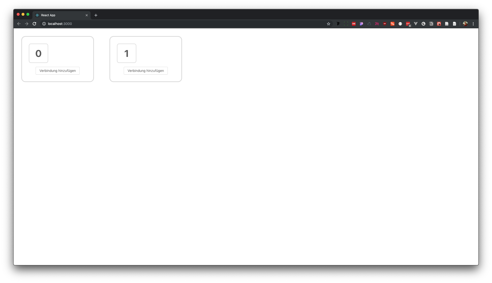

# Front-End

Das Front-End ist recht simpel aufgebaut und verfolgt nur den Zweck der Verwaltung von Verbindungen und der Übersicht der Geräte. 

Da sich die Geräte automatisch in der Datenbank registrieren, sobald sie das erste Mal eine Nachricht an den Server senden, muss man solche Funktionen auch nicht auf der Oberfläche haben.

Für jedes Gerät, das sich in der Datenbank befindet, besteht die Möglichkeit, eine Verbindung zu erstellen, welches auf Knopfdruck des Senders eine Aktion beim Empfänger triggert. 

In dem Dropdownfeld befinden sich alle verfügbaren Geräte, die eine Verbindung mit dem Gerät eingehen können. Hat man eine ausgewählt, bestätigt man diese mit "Sichern" und sie wird der Liste hinzugefügt. 

Wir nun der Knopf auf dem Gerät mit der ID 0 gedrückt, wird auf dem Gerät mit der ID 1 eine LED aufleuchten. 

