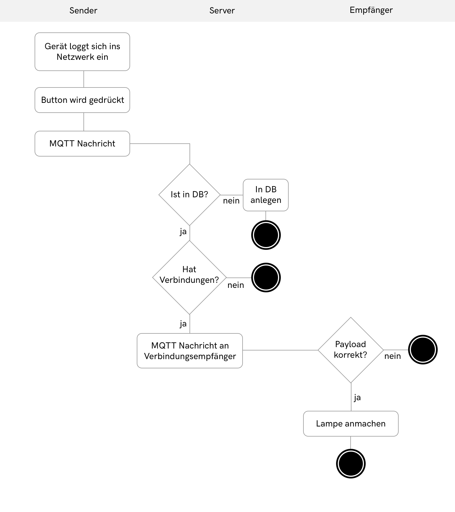

# Systemablauf

Der Ablauf des Systems ist recht leicht, hat aber ein paar Abfragen, um zu prüfen ob die Aktion korrekt ist oder nicht. So wird immer geprüft ob das Gerät von dem gerade eine Aktion aktiviert wird überhaupt in der Datenbank existiert, wenn nicht soll dieses in der Datenbank angelegt werden. 

Andere Prüfungen wie ob eine Verbindung zu anderen Geräten überhaupt existent ist, können den Prozess abbrechen, wenn diese nicht bejaht werden. 

